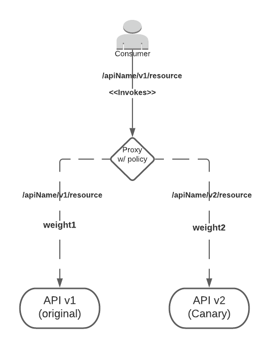
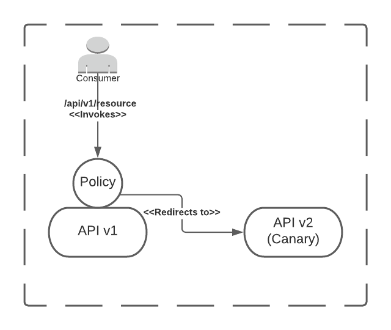

# canary-policy-mule-4
A custom policy to perform canary releases, intercepting the incoming calls and deciding which implementation URL to route the call to. Applying this policy to your API or proxy you would be able to:
  - Define an array of endpoints, with their weights
  - Enable session stickiness (TO-DO), to keep record of previous redirections based on a customizable header

### Why?
A canary release helps organizations to reduce the risks of introducing new versions of a software by incrementally rolling out traffic to the new version, improving the observability and limiting the impact of the new components over the existing service.

### How?
For a canary release to exist, the following elements should be present:
- An old version of the software, a REST API in this context
- A new version of the API, called the canary version (can be multiple canaries)
- API Consumers. They can be either the same types of consumers or different ones
- A routing criteria. This can be based on the type of audience, I.e. “consumers of type A will go to the old version, while consumers of type B will be canary consumers or early adopters, being redirected to the Canary version” or based on traffic, I.e. “90% of the traffic will be sent to the previous version, while the remaining 10% will be redirected to the canary version”
- A router, that based on the routing criteria, redirects the traffic to the available endpoints  

### Deployment Architecture

There are no limitations imposed by the use of this policy regarding the deployment architecture, except the need of having two artifacts (applications) deployed in Anypoint Runtime Manager (one for each version). However, the following topology is recommended as it provides a more flexible solution in terms of deprecation and retirement and, also, improves the [observability](https://en.wikipedia.org/wiki/Observability)

From the above, a proxy could is deployed on top of both versions (original and canary) in order to centralize communication, providing an abstraction and improving understanding from the point of view of networking and traffic management. Please see ["Limitations"](#Limitations) section.

If you want to skip the extra layer added by the proxy, you can always apply the policy on top of the original application:

But this approach may lead to a management nightmare, where deprecation and retirement of APIs become an almost impossible task. See ["Deprecation and Retirement"](#"Deprecation and Retirement") section.

### Deprecation and Retirement
Ask yourself: What do I want to do to discontinue the original version of my API when the Canary version has been tested and is ready to be used as current version?
Here are a series of strategies for that end:
- "Increase the weight of my Canary version to 100%, so that the traffic is only redirected there". This is an option that the only thing it achieves is an ease in the configuration, but under no point of view it is the optimal solution, since adopted in a proxy, it will generate an inconsistency between the implementation url configured in the proxy and the real url. Even worse if this strategy is used when applying the policy on the original API (no proxy), since this component will not only consume unnecessary resources, but it cannot be removed to ensure the existence of the policy that makes the routing.
- "Remove the policy from the Proxy and change the implementation url from original to canary". This is a valid option, but keep in mind that it depends on how the proxy is accessed, because it can mean a breaking change for the consumer. This option is very valid for when the canaries strategy is limited to deploying minor changes that do not impact the versioning strategy of the API spec (build numbers, for instance v1.1, v1.2, both under same path /v1).
- "Remove the proxy, along with the policy": It is the cleanest way to proceed, but the most complex and risky. Requires that the canary application be redeployed first as the original app (if it is a non breaking change) or leave it as is (for major changes, breaking) and make the normal changes expected as part of the normal API SDLC

### Usage
After publishing to Exchange, follow these steps to apply the policy to an existing managed API (or proxy):

* Log into Anypoint Platform
* Enter API Manager
* Click on the API version for the application you want to apply the policy to
* Click on Policies
* Click on Apply New Policy
* Filter by 'Custom' category and select 'Canary Release (Mule 4)'. Click on 'Configure Policy' button
* Give value to the policy's parameters:

| Parameter | Purpose |
| ------ | ------ |
| Endpoints | Details the paths and weights of the multiple versions |
|  |  |

#### Development

The following commands are required during development phase

| Task | Command |
| ------ | ------ |
| Package policy | mvn clean install |
| Publish to Exchange - Make sure to update the pom.xml file with your org ID - | mvn deploy |

### Limitations
NOTE: The recommended approach to manage Canary Releases should be having a third party component, outside Anypoint Platform, specially designed to handle this kind of needs. For instance, nginx provides a module called [split clients](https://nginx.org/en/docs/http/ngx_http_split_clients_module.html?_ga=2.76046677.1103157284.1620664242-1521291711.1620664242 ), useful to assign percentages of traffic that we want to redirect to defined clients (hosts). The solution provided here is a custom solution, provided by Professional Services and and that may not have official product support.

If you want to use this solution anyway, this approach leads to the following problems (may or may not be applicable to your organization):
- The networking team is the one who normally manage traffic to services. This policy would change that if applied by Developers, making it complex to define a clear ownership model, understand and manage it. Furthermore, these teams will need access to applications in order to handle the changes
- The routing would be done from a component that is applied on top of a mule application or proxy. Not a device specially designed for this purpose such as, for example, a Load Balancer
- In case of the traffic weight algorithm, the solution needs to store metadata of each request, and that metadata should be available for all the members of a cluster (servers, workers, pods). The storage is managed by the Object Store module, so please consider the technical challenges that the use of this module implies
- Extra component is required (proxy), adding more hops to the process -OPTIONAL if proxy approach was chosen-. In a typical API-Led approach, having an additional step on top of the existing 3 layers might be counterproductive with defined SLAs and SLOs
- Adds environment promotion complexity as part of the CI/CD pipelines
- Deprecation and Retirement becomes a time consuming task (more than usual!)

### Benchmark

#### Application config

| Deployment Model | Runtime Version | Worker Size | Workers |
| ------ | ------ | ------ | ------ |
| CloudHub (US East - Ohio - ) | 4.3.0 | 0.1 | 1 |

#### Test #0 -  NO policy applied -

##### Test suite configuration
TO-DO

##### Results

| Avg  | Median | Min | Max | Error Rate | Throughput |
| ------ | ------ | ------ | ------ | ------ | ------ |
|  |  |  |  |  |  |

#### Test #1

##### Policy configuration
TO-DO

##### Test suite configuration
TO-DO

##### Results
TO-DO

#### Test #2

##### Policy configuration
TO-DO

##### Test suite configuration
TO-DO

##### Results
TO-DO

### Contribution

Want to contribute? Great!

* For public contributions - Just fork the repo, make your updates and open a pull request!
* For internal contributions - Use a simplified feature workflow following these steps:
   - Clone the repo
   - Create a feature branch using the naming convention feature/name-of-the-feature
   - Once it's ready, push your changes
   - Open a pull request for a review
